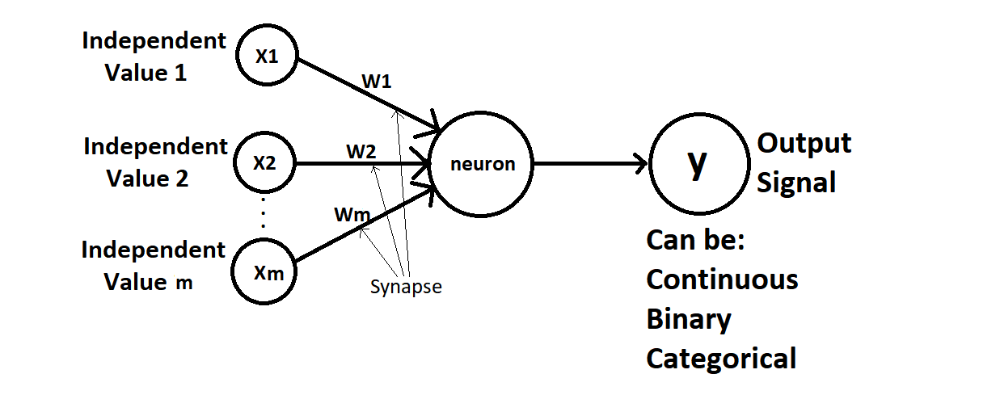
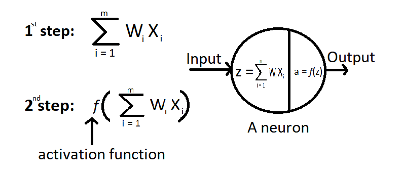

# Neural Network from scratch

## This repository is made for the sole purpose of implementing and showing how to implement Neural Network from scratch
### For this I have used the dataset of a bank which contains the data about different customers and whether they left the bank or not

### For implementing a Neural Network, there are 3 main steps:
#### Forward Propagation
#### Computing cost
#### Backward Propagation

# Image of a perceptron

### A perceptron is a single neuron neural network.

# Image of a neural network

##### Here the input layer contains 3 units, 1st hidden layer contains 4 units, 2nd hidden layer contains 4 units and the output layer contains 1 unit. This is a 3 layer network because we don't count input layer as a layer.

## What happens inside a neuron?

## How do neural networks work?

### Shallow Neural networks
The neural networks where there are no hidden layers.

These type of networks are generally not powerful and not used so much.

### Deep Neural networks

Suppose we want our network to predict the value of a particular house. We want to predict based on the inputs which are area of house in square meters, number of bedrooms, distance to city and age of the house. We give these inputs in the network and based on these inputs, we want our network to predict the value of the house.
We then train our network with many training examples(those whose values are known to us from previous experience).

After the network is trained(assume for now),
it will understand not every weight is important. Some will have zero value, some will have non-zero value.

Suppose, in the first neuron, the neuron is looking for the rooms which are large and not far away from cities. It will activate only when certain criteria is met. It does take account of bedrooms and age.

In the third neuron, the neuron picked area, # of bedrooms and age. Why did it picked all these three parameters not else.
The neuron may found out that the combination of area, bedrooms and age may be important in that specific city. Maybe in that city, lots of families are looking for large rooms with more bedrooms which are new. From training, the neuron will know that the room with area, bedroom and less age is valued from the training data.

In the last neuron, it will only be based on Age. If the age of the building in that city is above 100 years. Then it will be historic and more valuable. So, as soon as neuron picks it, it will activate.

##### Weight matrix

The arrows in the neural networks between the layers represents the weights. Weight matrix is the collection of weights of the same layer.

What is a weight matrix? A weight matrix is nothing but a matrix of random numbers with shape of (current, previous) where current is the number of units/nodes(A unit is a single neuron in a network) in the current layers(for which you are calculating the activations and previous is the number of nodes/units from the previous activation layer)
For example, if your network have a 3 layer architecture with [3, 4, 4, 1] nodes. [3, 4, 4, 1] means 3 nodes in input layer, 4 nodes in the first hidden layer, 4 nodes in the second hidden layer and 1 node in the output layer.
Now, as you have noticed there are 4 elements in the array. That's because we don't count input layer as a seperate layer. So, if we want to find number of layers in a neural network then it would be equal to number of hidden layers and output layer.

So, if we go by this example W1 will have shape (4, 3), W2 will have shape (4, 4) and W3 will have shape (1, 4) and each element of these matrices will be initialized with small random values. We never take W0 as there is no point of taking a weight which is giving output to input layer.

For finding the activation/output of first hidden layer, we have to do the dot product between the W1(first layer weight matrix) and (X)input layer(which is the previous layer). So the output Z1[1] will be W1.X. If bias(b) is also added then it would be equal to W1.X + b.
Zn[m] -->  output of nth node in layer m\
Z1[1] -->  output of 1st node in layer 1\
Z2[1] -->  output of 2nd node in layer 1\
Z3[1] -->  output of 3rd node in layer 1\
Z4[1] -->  output of 4th node in layer 1

So,
              Z1 = W1.X + b
Similarly,
              Z2 = W2.A1 + b
              Z3 = W3.A2 + b
We shall see A1, A2, A3 later when we see about activation functions.

#### Bias
Bias is only used to improve the performance of the model or used so that the dot product of weights and activations of previous layers never become 0. But, it is optional. It may depend on the developer whether he uses bias or not. It is denoted by 'b' and has the shape of (number of units in current layer, 1). So, if layer dimensions are [3, 4, 4, 1] then b1 will have shape (4, 1). b2 will have shape (4, 1) and b3 will have shape (1, 1).

#### Activation Functions:
Every output of a node is then passed through an activation function. Most of the times, non linear activation functions are used. Activation functions are a very important part of neural network. It helps in computing the result in desirable form and also helps in improving accuracy of our model.\
It is denoted by A(Z). A(Z) means the output when activation function of Z.
Similarly, A(Z1) means activation function of Z1.

There are many types of activation functions but some of the popular activation functions are:
1. Threshold Activation Function
2. Sigmoid Function
3. Tanh Activation Function
4. Rectified Linear Unit Function(ReLU)

##### 1. Threshold activation function

It is equal to 1 when x>=0 and 0 when x<0.

##### 2. Sigmoid activation function

It scales the values between 0 and 1. It is commonly used in the output layer of neural network if we want our neural network model to classify between two objects(0 and 1)

  

##### 3. Tanh activation function

It is known as hyperbolic tangent function. It is a non-linear activation function used in the activations of hidden layers. It scales the values between 1 and -1.

##### Difference between Sigmoid and Tanh Activation Function.
You may think that sigmoid and tanh functions are very similar. They are very much similar but the main difference between them is **sigmoid** function scales the values between 0 and 1 whereas **tanh** function scales the values between -1 and 1.

##### Which to choose between Sigmoid and Tanh?
You may ask which activation function to choose between the two functions. Generally, always **tanh** function outperforms the **sigmoid** function because in **tanh** function, the *mean* of activations that come out of hidden layers are closer to 0 which is a good thing. So, always **tanh** functions are prefered. There is only one case when **sigmoid** function is preferred over **tanh** function is when we are at output layer and doing binary classification. Otherwise, always *tanh* is used. Although, there is no such rule.

##### Disadvantage of **Sigmoid** and **Tanh** *activation functions*!
First, you need to understand that weights are updated faster when slope of activation function is high, but weights will update slowly when slope of activation function is less.
The main disadvantage is the slope of these functions are very less when x is very small or x is very large. So, when Z is either very small or very large then weights will also update slowly, so the model learns slowly.

##### 4. ReLU activation function

This activation function is the first choice of many experienced people in deep learning industry for hidden layers. This is one of the best activation functions. It basically takes the maximum value between 0 and Z.
##### For example,

#### Forward Propagation
Forward Propagation is nothing but series of matrix multiplications along the depth of the network, where the weights of current layer is taken dot product with the activation matrix of previous layers.

Z1 = W[1].T.A[0] + b(if present)\
A1 = f(Z1)\
Z2 = W[2].T.A[1] + b\
A2 = f(Z2)\
Z3 = W[3].T.A[2] + b\
A3 = f(Z3)\
Z4 = W[4].T.A[3] + b\
A4 = f(Z4)

##### The prediction of neural network would be equal to A4.
#####                    y_pred = A4
